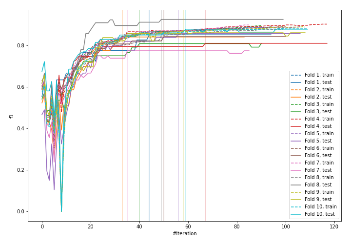
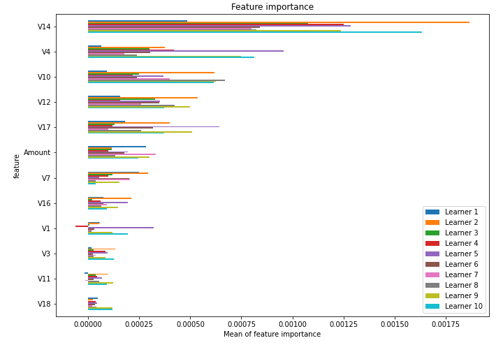

# Summary of 1_Default_CatBoost

[<< Go back](../README.md)

## CatBoost
- **n_jobs**: -1
- **learning_rate**: 0.1
- **depth**: 6
- **rsm**: 1
- **loss_function**: Logloss
- **eval_metric**: F1
- **explain_level**: 1

## Validation
 - **validation_type**: kfold
 - **k_folds**: 10
 - **shuffle**: True
 - **random_seed**: 1997

## Optimized metric
f1

## Training time

44.7 seconds

## Metric details
|           |      score |     threshold |
|:----------|-----------:|--------------:|
| logloss   | 0.00309474 | nan           |
| auc       | 0.96851    | nan           |
| f1        | 0.849612   |   0.474383    |
| accuracy  | 0.999531   |   0.474383    |
| precision | 0.931973   |   0.474383    |
| recall    | 1          |   1.81519e-05 |
| mcc       | 0.852726   |   0.474383    |

## Confusion matrix (at threshold=0.474383)
|                     |   Predicted as negative |   Predicted as positive |
|:--------------------|------------------------:|------------------------:|
| Labeled as negative |                  206376 |                      20 |
| Labeled as positive |                      77 |                     274 |

## Learning curves

## Permutation-based Importance

[<< Go back](../README.md)
