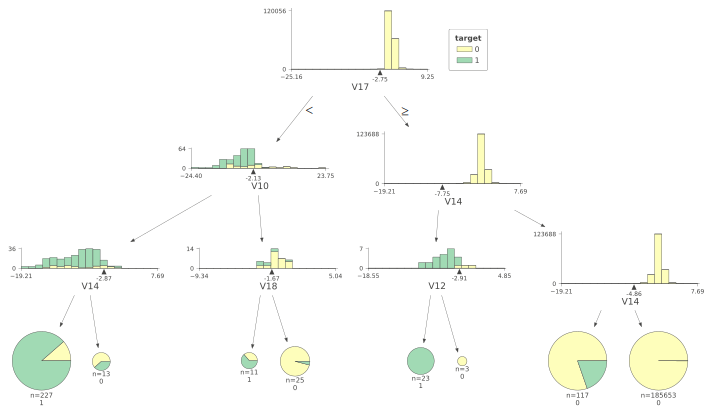
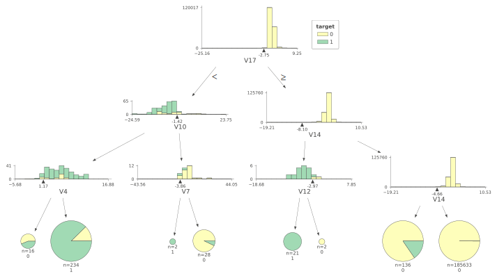

# Summary of 1_DecisionTree

[<< Go back](../README.md)

## Decision Tree
- **n_jobs**: -1
- **criterion**: gini
- **max_depth**: 3
- **explain_level**: 1

## Validation
 - **validation_type**: kfold
 - **k_folds**: 10
 - **shuffle**: True
 - **random_seed**: 1997

## Optimized metric
f1

## Training time

205.2 seconds

## Metric details
|           |      score |   threshold |
|:----------|-----------:|------------:|
| logloss   | 0.00381487 |  nan        |
| auc       | 0.889383   |  nan        |
| f1        | 0.779874   |    0.443866 |
| accuracy  | 0.999323   |    0.443866 |
| precision | 0.852234   |    0.443866 |
| recall    | 0.994203   |    0        |
| mcc       | 0.782371   |    0.443866 |

## Confusion matrix (at threshold=0.443866)
|                     |   Predicted as negative |   Predicted as positive |
|:--------------------|------------------------:|------------------------:|
| Labeled as negative |                  206359 |                      43 |
| Labeled as positive |                      97 |                     248 |

## Learning curves

## Decision Tree 

### Tree #1

### Rules

if (V17 > -2.754) and (V14 > -7.755) and (V14 > -4.861) then class: 0 (proba: 99.97%) | based on 185,653 samples

if (V17 <= -2.754) and (V10 <= -2.129) and (V14 <= -2.87) then class: 1 (proba: 88.55%) | based on 227 samples

if (V17 > -2.754) and (V14 > -7.755) and (V14 <= -4.861) then class: 0 (proba: 80.34%) | based on 117 samples

if (V17 <= -2.754) and (V10 > -2.129) and (V18 > -1.673) then class: 0 (proba: 96.0%) | based on 25 samples

if (V17 > -2.754) and (V14 <= -7.755) and (V12 <= -2.909) then class: 1 (proba: 100.0%) | based on 23 samples

if (V17 <= -2.754) and (V10 <= -2.129) and (V14 > -2.87) then class: 0 (proba: 61.54%) | based on 13 samples

if (V17 <= -2.754) and (V10 > -2.129) and (V18 <= -1.673) then class: 1 (proba: 63.64%) | based on 11 samples

if (V17 > -2.754) and (V14 <= -7.755) and (V12 > -2.909) then class: 0 (proba: 100.0%) | based on 3 samples

### Tree #2

### Rules

if (V17 > -2.754) and (V14 > -8.098) and (V14 > -4.859) then class: 0 (proba: 99.97%) | based on 185,653 samples

if (V17 <= -2.754) and (V10 <= -2.129) and (V14 <= -2.964) then class: 1 (proba: 87.93%) | based on 232 samples

if (V17 > -2.754) and (V14 > -8.098) and (V14 <= -4.859) then class: 0 (proba: 80.51%) | based on 118 samples

if (V17 <= -2.754) and (V10 > -2.129) and (V18 > -1.673) then class: 0 (proba: 95.24%) | based on 21 samples

if (V17 <= -2.754) and (V10 <= -2.129) and (V14 > -2.964) then class: 0 (proba: 55.56%) | based on 18 samples

if (V17 > -2.754) and (V14 <= -8.098) and (V12 <= -2.967) then class: 1 (proba: 100.0%) | based on 17 samples

if (V17 <= -2.754) and (V10 > -2.129) and (V18 <= -1.673) then class: 1 (proba: 60.0%) | based on 10 samples

if (V17 > -2.754) and (V14 <= -8.098) and (V12 > -2.967) then class: 0 (proba: 100.0%) | based on 3 samples

### Tree #3

### Rules

if (V17 > -2.754) and (V14 > -8.098) and (V14 > -4.66) then class: 0 (proba: 99.97%) | based on 185,630 samples

if (V17 <= -2.754) and (V10 <= -2.129) and (V14 <= -2.964) then class: 1 (proba: 88.94%) | based on 226 samples

if (V17 > -2.754) and (V14 > -8.098) and (V14 <= -4.66) then class: 0 (proba: 84.14%) | based on 145 samples

if (V17 <= -2.754) and (V10 > -2.129) and (V18 > -1.673) then class: 0 (proba: 95.24%) | based on 21 samples

if (V17 > -2.754) and (V14 <= -8.098) and (V12 <= -2.967) then class: 1 (proba: 100.0%) | based on 20 samples

if (V17 <= -2.754) and (V10 <= -2.129) and (V14 > -2.964) then class: 0 (proba: 58.82%) | based on 17 samples

if (V17 <= -2.754) and (V10 > -2.129) and (V18 <= -1.673) then class: 1 (proba: 70.0%) | based on 10 samples

if (V17 > -2.754) and (V14 <= -8.098) and (V12 > -2.967) then class: 0 (proba: 100.0%) | based on 3 samples

### Tree #4

### Rules

if (V17 > -2.754) and (V14 > -8.098) and (V14 > -4.861) then class: 0 (proba: 99.97%) | based on 185,659 samples

if (V17 <= -2.754) and (V10 <= -1.419) and (V14 <= -3.442) then class: 1 (proba: 88.74%) | based on 222 samples

if (V17 > -2.754) and (V14 > -8.098) and (V14 <= -4.861) then class: 0 (proba: 82.76%) | based on 116 samples

if (V17 <= -2.754) and (V10 > -1.419) and (V16 > -2.986) then class: 0 (proba: 91.67%) | based on 24 samples

if (V17 <= -2.754) and (V10 <= -1.419) and (V14 > -3.442) then class: 0 (proba: 50.0%) | based on 22 samples

if (V17 > -2.754) and (V14 <= -8.098) and (V12 <= -2.967) then class: 1 (proba: 100.0%) | based on 20 samples

if (V17 <= -2.754) and (V10 > -1.419) and (V16 <= -2.986) then class: 1 (proba: 66.67%) | based on 6 samples

if (V17 > -2.754) and (V14 <= -8.098) and (V12 > -2.967) then class: 0 (proba: 100.0%) | based on 3 samples

### Tree #5

### Rules

if (V17 > -2.754) and (V14 > -8.098) and (V14 > -4.66) then class: 0 (proba: 99.97%) | based on 185,633 samples

if (V17 <= -2.754) and (V10 <= -1.419) and (V4 > 1.169) then class: 1 (proba: 87.61%) | based on 234 samples

if (V17 > -2.754) and (V14 > -8.098) and (V14 <= -4.66) then class: 0 (proba: 84.56%) | based on 136 samples

if (V17 <= -2.754) and (V10 > -1.419) and (V7 > -3.861) then class: 0 (proba: 92.86%) | based on 28 samples

if (V17 > -2.754) and (V14 <= -8.098) and (V12 <= -2.967) then class: 1 (proba: 100.0%) | based on 21 samples

if (V17 <= -2.754) and (V10 <= -1.419) and (V4 <= 1.169) then class: 0 (proba: 56.25%) | based on 16 samples

if (V17 > -2.754) and (V14 <= -8.098) and (V12 > -2.967) then class: 0 (proba: 100.0%) | based on 2 samples

if (V17 <= -2.754) and (V10 > -1.419) and (V7 <= -3.861) then class: 1 (proba: 100.0%) | based on 2 samples

### Tree #6

### Rules

if (V17 > -2.754) and (V14 > -8.098) and (V14 > -4.992) then class: 0 (proba: 99.97%) | based on 185,664 samples

if (V17 <= -2.754) and (V10 <= -2.129) and (V14 <= -2.964) then class: 1 (proba: 88.0%) | based on 225 samples

if (V17 > -2.754) and (V14 > -8.098) and (V14 <= -4.992) then class: 0 (proba: 80.0%) | based on 110 samples

if (V17 <= -2.754) and (V10 > -2.129) and (V18 > -1.673) then class: 0 (proba: 95.65%) | based on 23 samples

if (V17 > -2.754) and (V14 <= -8.098) and (V12 <= -2.967) then class: 1 (proba: 100.0%) | based on 19 samples

if (V17 <= -2.754) and (V10 <= -2.129) and (V14 > -2.964) then class: 0 (proba: 55.56%) | based on 18 samples

if (V17 <= -2.754) and (V10 > -2.129) and (V18 <= -1.673) then class: 1 (proba: 70.0%) | based on 10 samples

if (V17 > -2.754) and (V14 <= -8.098) and (V12 > -2.967) then class: 0 (proba: 100.0%) | based on 3 samples

### Tree #7

### Rules

if (V17 > -2.754) and (V14 > -9.018) and (V14 > -4.97) then class: 0 (proba: 99.97%) | based on 185,657 samples

if (V17 <= -2.754) and (V10 <= -2.144) and (V4 > -0.183) then class: 1 (proba: 87.55%) | based on 249 samples

if (V17 > -2.754) and (V14 > -9.018) and (V14 <= -4.97) then class: 0 (proba: 77.88%) | based on 113 samples

if (V17 <= -2.754) and (V10 > -2.144) and (V18 > -1.658) then class: 0 (proba: 100.0%) | based on 22 samples

if (V17 > -2.754) and (V14 <= -9.018) and (V12 <= -3.457) then class: 1 (proba: 100.0%) | based on 16 samples

if (V17 <= -2.754) and (V10 > -2.144) and (V18 <= -1.658) then class: 1 (proba: 60.0%) | based on 10 samples

if (V17 <= -2.754) and (V10 <= -2.144) and (V4 <= -0.183) then class: 0 (proba: 100.0%) | based on 4 samples

if (V17 > -2.754) and (V14 <= -9.018) and (V12 > -3.457) then class: 0 (proba: 100.0%) | based on 1 samples

### Tree #8

### Rules

if (V17 > -2.754) and (V14 > -7.755) and (V14 > -4.97) then class: 0 (proba: 99.97%) | based on 185,670 samples

if (V17 <= -2.754) and (V10 <= -2.129) and (V14 <= -2.964) then class: 1 (proba: 88.74%) | based on 231 samples

if (V17 > -2.754) and (V14 > -7.755) and (V14 <= -4.97) then class: 0 (proba: 79.81%) | based on 104 samples

if (V17 > -2.754) and (V14 <= -7.755) and (V12 <= -2.909) then class: 1 (proba: 100.0%) | based on 22 samples

if (V17 <= -2.754) and (V10 > -2.129) and (V18 > -1.676) then class: 0 (proba: 94.44%) | based on 18 samples

if (V17 <= -2.754) and (V10 <= -2.129) and (V14 > -2.964) then class: 0 (proba: 57.14%) | based on 14 samples

if (V17 <= -2.754) and (V10 > -2.129) and (V18 <= -1.676) then class: 1 (proba: 55.56%) | based on 9 samples

if (V17 > -2.754) and (V14 <= -7.755) and (V12 > -2.909) then class: 0 (proba: 100.0%) | based on 5 samples

### Tree #9

### Rules

if (V17 > -2.754) and (V14 > -8.098) and (V14 > -4.861) then class: 0 (proba: 99.97%) | based on 185,647 samples

if (V17 <= -2.754) and (V10 <= -2.129) and (V14 <= -2.964) then class: 1 (proba: 88.09%) | based on 235 samples

if (V17 > -2.754) and (V14 > -8.098) and (V14 <= -4.861) then class: 0 (proba: 81.82%) | based on 121 samples

if (V17 <= -2.754) and (V10 > -2.129) and (V18 > -1.673) then class: 0 (proba: 95.83%) | based on 24 samples

if (V17 <= -2.754) and (V10 <= -2.129) and (V14 > -2.964) then class: 0 (proba: 55.56%) | based on 18 samples

if (V17 > -2.754) and (V14 <= -8.098) and (V12 <= -2.659) then class: 1 (proba: 100.0%) | based on 17 samples

if (V17 <= -2.754) and (V10 > -2.129) and (V18 <= -1.673) then class: 1 (proba: 66.67%) | based on 9 samples

if (V17 > -2.754) and (V14 <= -8.098) and (V12 > -2.659) then class: 0 (proba: 100.0%) | based on 2 samples

### Tree #10

### Rules

if (V17 > -2.769) and (V14 > -8.098) and (V14 > -4.861) then class: 0 (proba: 99.97%) | based on 185,654 samples

if (V17 <= -2.769) and (V10 <= -2.129) and (V4 > 1.169) then class: 1 (proba: 87.67%) | based on 227 samples

if (V17 > -2.769) and (V14 > -8.098) and (V14 <= -4.861) then class: 0 (proba: 80.49%) | based on 123 samples

if (V17 <= -2.769) and (V10 > -2.129) and (V18 > -1.673) then class: 0 (proba: 96.0%) | based on 25 samples

if (V17 > -2.769) and (V14 <= -8.098) and (V12 <= -2.967) then class: 1 (proba: 100.0%) | based on 17 samples

if (V17 <= -2.769) and (V10 <= -2.129) and (V4 <= 1.169) then class: 0 (proba: 60.0%) | based on 15 samples

if (V17 <= -2.769) and (V10 > -2.129) and (V18 <= -1.673) then class: 1 (proba: 77.78%) | based on 9 samples

if (V17 > -2.769) and (V14 <= -8.098) and (V12 > -2.967) then class: 0 (proba: 100.0%) | based on 3 samples

## Permutation-based Importance

[<< Go back](../README.md)
