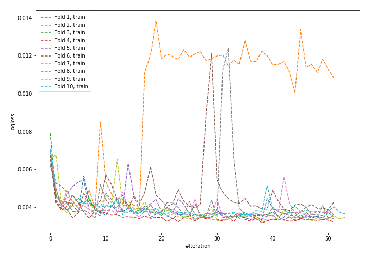
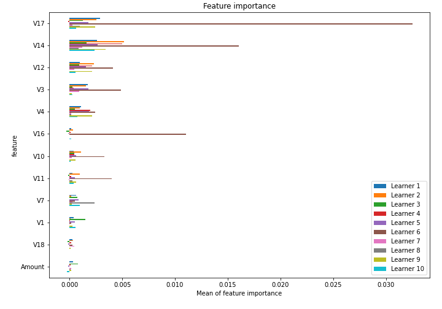

# Summary of 1_Default_NeuralNetwork

[<< Go back](../README.md)

## Neural Network
- **n_jobs**: -1
- **dense_1_size**: 32
- **dense_2_size**: 16
- **learning_rate**: 0.05
- **explain_level**: 1

## Validation
 - **validation_type**: kfold
 - **k_folds**: 10
 - **shuffle**: True
 - **random_seed**: 1997

## Optimized metric
f1

## Training time

350.5 seconds

## Metric details
|           |      score |     threshold |
|:----------|-----------:|--------------:|
| logloss   | 0.00386043 | nan           |
| auc       | 0.950215   | nan           |
| f1        | 0.822653   |   0.452456    |
| accuracy  | 0.999424   |   0.452456    |
| precision | 0.846626   |   0.452456    |
| recall    | 1          |   3.8731e-153 |
| mcc       | 0.822696   |   0.452456    |

## Confusion matrix (at threshold=0.452456)
|                     |   Predicted as negative |   Predicted as positive |
|:--------------------|------------------------:|------------------------:|
| Labeled as negative |                  206352 |                      50 |
| Labeled as positive |                      69 |                     276 |

## Learning curves

## Permutation-based Importance

[<< Go back](../README.md)
