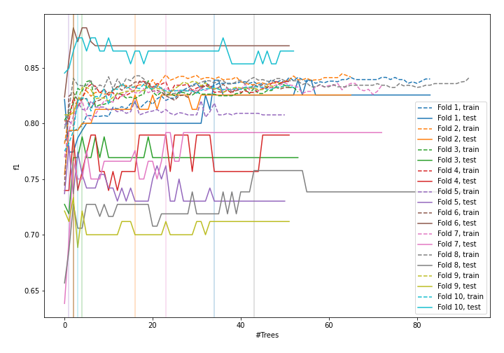
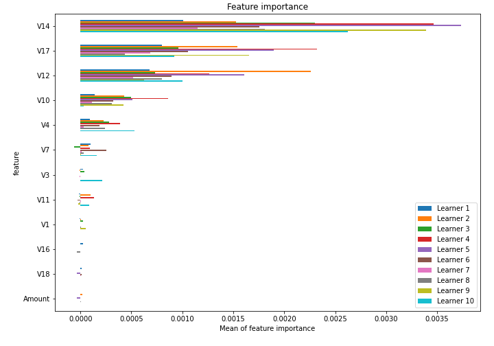

# Summary of 1_Default_RandomForest

[<< Go back](../README.md)

## Random Forest
- **n_jobs**: -1
- **criterion**: gini
- **max_features**: 0.9
- **min_samples_split**: 30
- **max_depth**: 4
- **eval_metric_name**: f1
- **explain_level**: 1

## Validation
 - **validation_type**: kfold
 - **k_folds**: 10
 - **shuffle**: True
 - **random_seed**: 1997

## Optimized metric
f1

## Training time

113.9 seconds

## Metric details
|           |      score |     threshold |
|:----------|-----------:|--------------:|
| logloss   | 0.00337719 | nan           |
| auc       | 0.914741   | nan           |
| f1        | 0.799387   |   0.459631    |
| accuracy  | 0.999366   |   0.459631    |
| precision | 0.847403   |   0.459631    |
| recall    | 1          |   0.000208493 |
| mcc       | 0.800361   |   0.459631    |

## Confusion matrix (at threshold=0.459631)
|                     |   Predicted as negative |   Predicted as positive |
|:--------------------|------------------------:|------------------------:|
| Labeled as negative |                  206355 |                      47 |
| Labeled as positive |                      84 |                     261 |

## Learning curves

## Permutation-based Importance

[<< Go back](../README.md)
