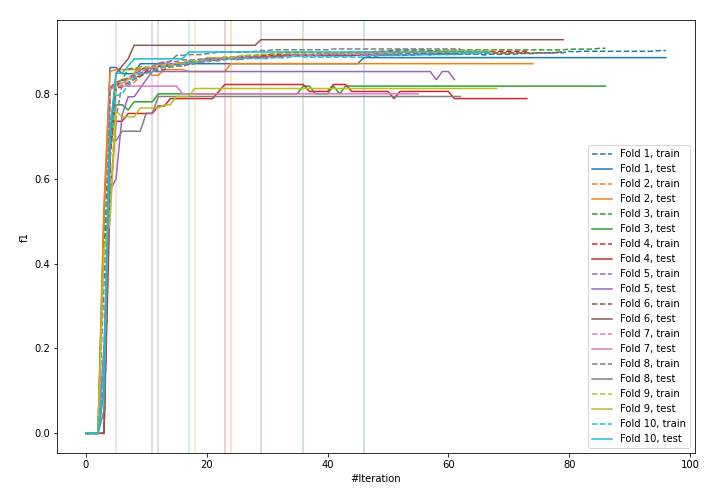
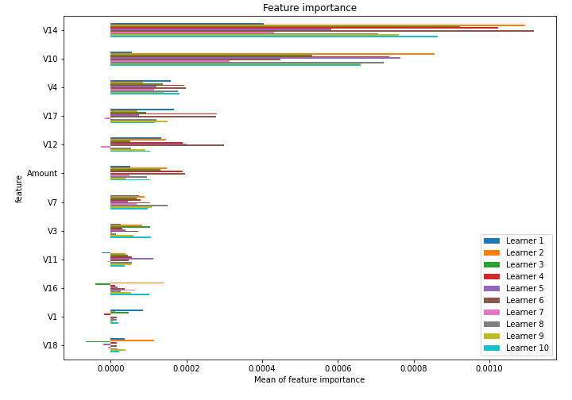

# Summary of 1_Default_Xgboost

[<< Go back](../README.md)

## Extreme Gradient Boosting (Xgboost)
- **n_jobs**: -1
- **objective**: binary:logistic
- **eta**: 0.075
- **max_depth**: 6
- **min_child_weight**: 1
- **subsample**: 1.0
- **colsample_bytree**: 1.0
- **eval_metric**: f1
- **explain_level**: 1

## Validation
 - **validation_type**: kfold
 - **k_folds**: 10
 - **shuffle**: True
 - **random_seed**: 1997

## Optimized metric
f1

## Training time

75.7 seconds

## Metric details
|           |    score |   threshold |
|:----------|---------:|------------:|
| logloss   | 0.133929 | nan         |
| auc       | 0.921456 | nan         |
| f1        | 0.853168 |   0.456902  |
| accuracy  | 0.999541 |   0.456902  |
| precision | 0.913907 |   0.456902  |
| recall    | 1        |   0.0130897 |
| mcc       | 0.854835 |   0.456902  |

## Confusion matrix (at threshold=0.456902)
|                     |   Predicted as negative |   Predicted as positive |
|:--------------------|------------------------:|------------------------:|
| Labeled as negative |                  206376 |                      26 |
| Labeled as positive |                      69 |                     276 |

## Learning curves

## Permutation-based Importance

[<< Go back](../README.md)
